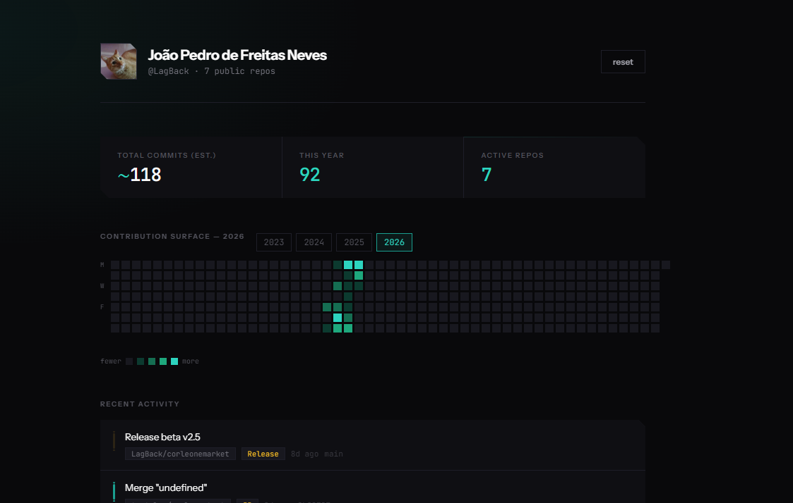

## Commit Activity Dashboard

A sleek, single-file dashboard that visualizes your GitHub commit activity in a clean dark interface. No frameworks, no build step, no dependencies — just open it in your browser and go.



## Features

- **Contribution heatmap** — year-by-year breakdown, exactly like GitHub's but with its own aesthetic
- **Commit statistics** — total estimated commits, this year's count, active repos at a glance
- **Recent activity feed** — pull requests, releases, and pushes displayed together in one timeline
- **Dark mode native** — designed around dark palettes with sharp geometry and clean typographic contrast

## Quick Start

1. Clone or download this repo
2. Open `commit-dashboard.html` in a browser via an HTTP server (see below)
3. Enter your GitHub username and a Personal Access Token with `read:user` and `repo` scopes
4. Hit **load stats**


## Tech Stack

| Layer | Choice |
|-------|--------|
| Framework | None — pure HTML/CSS/vanilla JS |
| Styling | Custom CSS with CSS variables, `clip-path`, flexbox |
| Data | GitHub REST API v3 |


## Project Structure

```
.
├── assets/
│   └── demo.png       # Screenshot used in this README
└── commit-dashboard.html  # The entire app, everything is here
```

That's it — one file for the full application.

## What It Pulls

The dashboard uses three GitHub API endpoints:

- `GET /users/{user}` — display name, handle, avatar
- `GET /users/{user}/repos` — list public repos and paginate through their commit history
- `GET /users/{user}/events` — recent activity (pushes, PRs, releases) merged into one timeline

All data is fetched client-side; nothing is stored or transmitted anywhere else.

## License

MIT.
